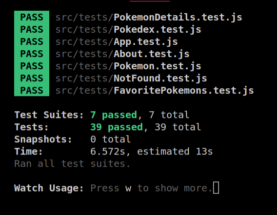
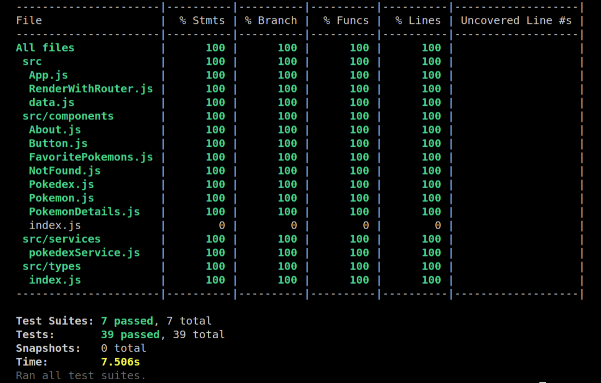
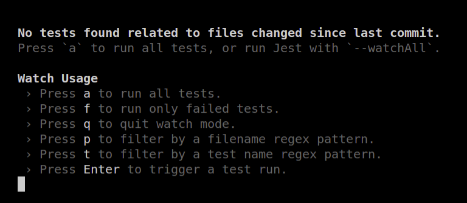

# Pokedex RTL

# Contexto
Este projeto foi feito com o intuito de colocar em prática o conhecimento adquirido sobre testes automatizados, com a biblioteca React Testing Library.
A aplicação em si, trata-se uma pokedex feita em React.js.

# Propriedade Intelectual
**As partes feitas por mim neste projeto, se refere somente aos arquivos da pasta `/src/tests`.
Todos os outros arquivos da aplicação são propriedade intelectual da Trybe**, eles foram feitos e fornecidos somente para a criação dos testes automatizados feitos por mim.

## Habilidades Desenvolvidas

* Utilizar os seletores (queries) da React-Testing-Library em testes automatizados.

* Simular eventos com a React-Testing-Library em testes automatizados.

* Testar fluxos lógicos assíncronos com a React-Testing-Library.

* Escrever testes que permitam a refatoração da estrutura dos componentes da aplicação sem necessidade de serem alterados.

* Criar mocks de APIs utilizando fetch.

* Testar inputs.

---

## Componentes Testados

 - `<App.js />`
 - `<About.js />`
 - `<FavoritePokemons.js />`
 - `<NotFound.js />`
 - `<Pokedex.js />`
 - `<Pokemon.js />`
 - `<PokemonDetails.js />`

### Resultado dos Testes



### Cobertura Alcançada




## Biblioteca usada

> Desenvolvido usando:  `@testing-library`


## Para clonar esse repositório:
1 - **Clonar projeto locamente**
```bash
git clone git@github.com:imgeff/pokedex-RTL.git
```

## Instalando Dependências

2 - **Entrar na  pasta do projeto**
```bash
cd pokedex-RTL
```
3 - **Instalar Dependências**
```bash
npm install
```
## Executando aplicação

* Para rodar a aplicação:

```
npm start
```

## Executando Testes

* Para rodar todos os testes:

```
  npm test
```
* Espere aparecer a seguinte tela no terminal e aperte a tecla `A`:


* Para Visualizar Cobertura de Testes:

```
  npm run test-coverage
```